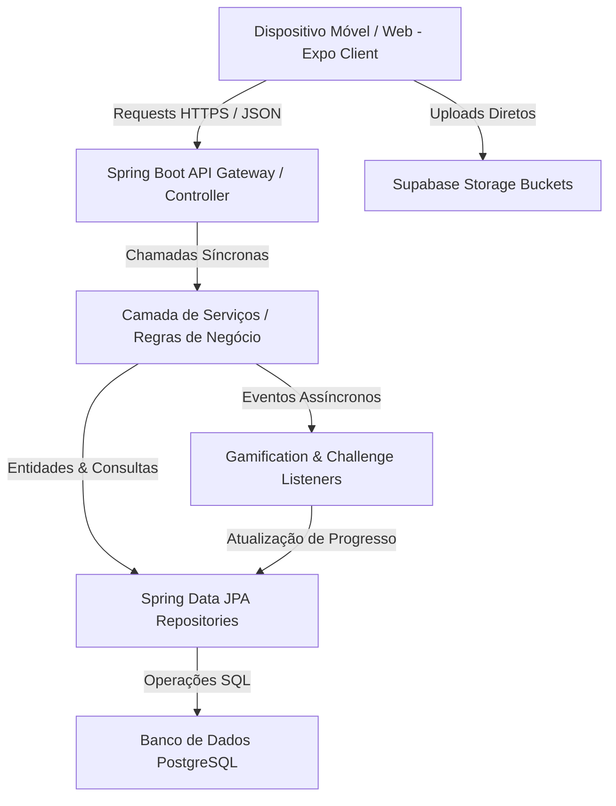

# Arquitetura de Software e Fluxos do Sistema (ARCHITECTURE.md)

Este documento analisa a organização lógica, padrões de design e o fluxo de dados arquitetural do projeto **Exploraê**.

---

## 🏛️ 1. Visão Geral da Arquitetura (Monorepo)

O Exploraê adota um modelo de **Monorepo** que consolida o Frontend Mobile e o Backend REST no mesmo repositório do Git, facilitando a sincronização de modelos de dados, DTOs e fluxos lógicos de desenvolvimento de ponta a ponta.

---

## ☕ 2. Arquitetura do Backend (Spring Boot Layered)

O backend é organizado no padrão clássico de **Arquitetura em Camadas** (Layered Architecture), separando rigorosamente as preocupações de transporte, negócio e persistência.

1.  **Camada de Entrada (Controllers / DTOs):**
    *   Fica em `br.edu.ifpb.explorae.api`.
    *   Recebe requisições HTTP, valida payloads de entrada com as anotações do Spring Validation (`@Valid`, `@NotNull`) e responde no padrão `StandardResponseDTO`.
    *   Mapeia DTOs para Entidades de domínio utilizando **MapStruct** para manter a independência das classes de banco de dados.
2.  **Camada de Negócio (Services):**
    *   Fica em `br.edu.ifpb.explorae.service`.
    *   Centraliza todas as regras de negócio complexas da aplicação, transações (`@Transactional`) e orquestrações.
3.  **Camada de Persistência (Repositories & Domain Entities):**
    *   Fica em `br.edu.ifpb.explorae.domain`.
    *   Contém entidades do JPA anotadas para mapeamento objeto-relacional (ORM) e interfaces de repositórios que herdam de `JpaRepository` com UUIDs como chaves primárias.

---

## 🎯 3. Gamificação Baseada em Padrão Strategy

A gamificação do Exploraê é um dos diferenciais de sua arquitetura. Para evitar acúmulos de lógicas condicionais complexas (`if/else`) ao desbloquear novas conquistas, o sistema adota o **Padrão Strategy** (Strategy Pattern) no processamento de medalhas.

*   **Interface Base (`BadgeProgressStrategy`):** Define o contrato unificado para avaliar o progresso de desbloqueio de uma medalha.
*   **Classes de Estratégia Específicas:** Localizadas em `br.edu.ifpb.explorae.service.badge`, cada classe herda de `BadgeProgressStrategy` e avalia um critério de negócio isolado:
    *   `PioneiroBadgeStrategy`: Avalia o desbloqueio para os primeiros check-ins.
    *   `ColecionadorBadgeStrategy`: Mede o acúmulo de favoritos e locais salvos.
    *   `CriticoBadgeStrategy`: Verifica a quantidade de avaliações escritas.
    *   `DesbravadorBadgeStrategy`: Analisa explorações por categorias específicas de locais.
*   **Orquestração Assíncrona via Eventos:**
    *   Interações críticas de usuários (fazer check-in, favoritar, escrever reviews) disparam eventos internos do Spring (`ApplicationEventPublisher`).
    *   Os listeners assíncronos `GamificationListener` e `ChallengeListener` reagem a esses eventos para computar ganhos de XP, avaliar progressão de nível e acionar o `BadgeEvaluationService` que executa todas as estratégias registradas no contexto, mantendo as rotas de interação extremamente rápidas e responsivas.

---

## 📱 4. Arquitetura do Frontend (Expo & React Native)

O aplicativo utiliza uma estrutura baseada em recursos (Feature-based e modular), integrada com as capacidades de roteamento nativo do Expo.

1.  **Roteamento (App Router - Expo Router):**
    *   Localizado na pasta `/src/app`.
    *   Utiliza roteamento declarativo e dinâmico estruturado por pastas.
    *   Contém controle de guardas de navegação (exemplo: redirecionamento obrigatório para `/preferences` se o usuário logado ainda não realizou o onboarding inicial de interesses de viagem).
2.  **Componentes (Components):**
    *   Separados por área em `/src/components` (`attraction`, `profile`, `common`).
    *   Compostos e altamente reutilizáveis, seguindo o padrão de estilização do Tailwind com NativeWind.
3.  **Provedores de Contexto (Contexts):**
    *   Centralizam o estado compartilhado, como o contexto de autenticação do usuário (`AuthContext`) e o disparo de animações visuais de medalhas conquistadas (`BadgeCelebrationContext`).
4.  **Serviços e APIs (Services):**
    *   Responsáveis pelo consumo das APIs do Spring Boot, isolando a lógica de requisições de rede dos componentes de UI.
