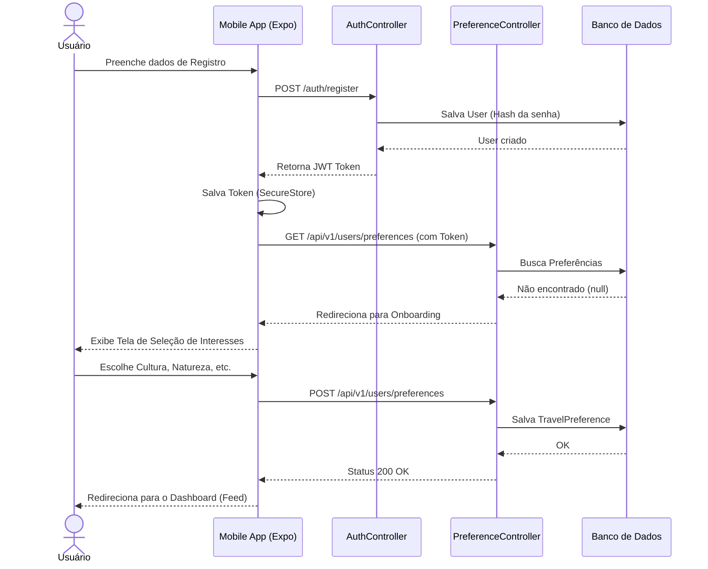
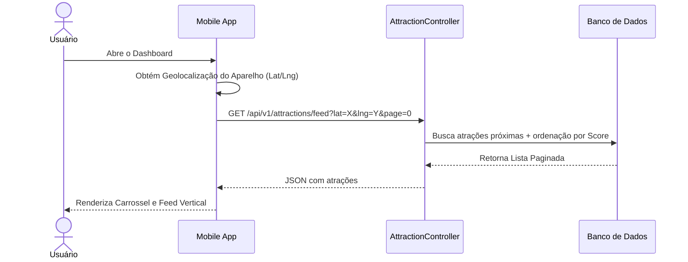
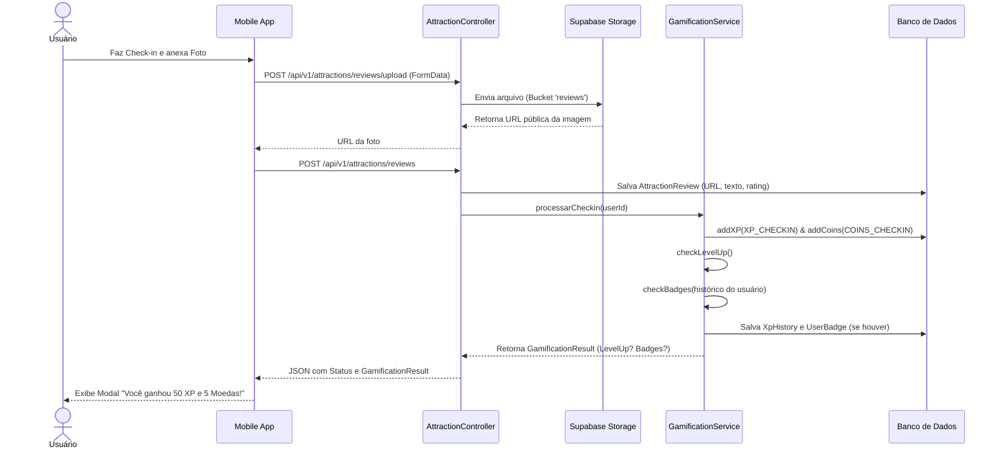
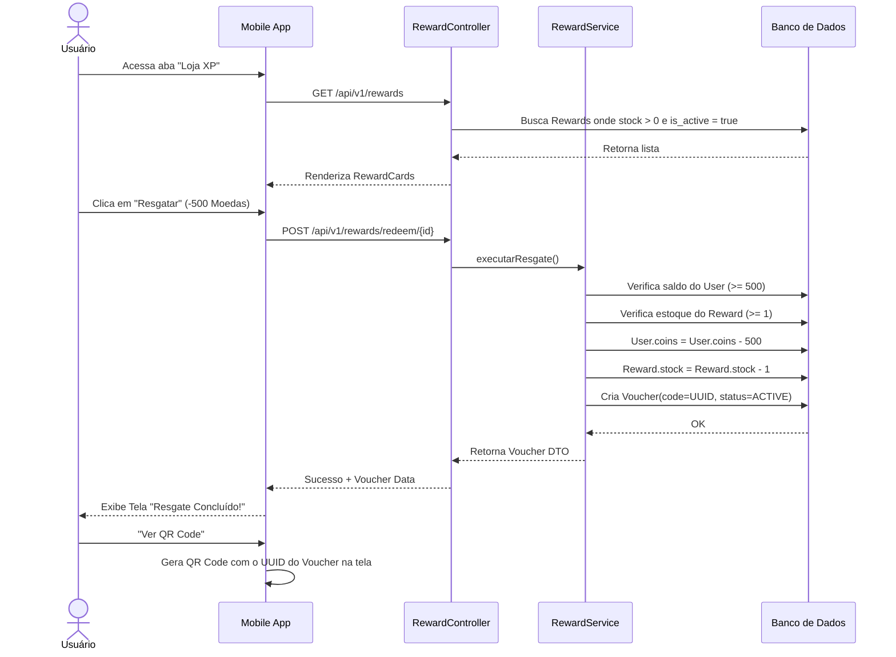

# Diagramas de Sequência - Exploraê

Este documento ilustra os fluxos principais do projeto usando diagramas de sequência. Esses diagramas detalham a comunicação entre o Frontend (Mobile App), o Backend (Spring Boot), o Banco de Dados (Supabase) e os Serviços internos.

---

## 1. Autenticação e Onboarding de Preferências

Este fluxo cobre o primeiro contato do usuário com o app, desde a criação da conta até o preenchimento obrigatório das preferências de viagem.

---

## 2. Feed Paginado e Carrossel

Fluxo que descreve como o aplicativo carrega as atrações para exibir na tela principal do Explorador, baseando-se em geolocalização.

---

## 3. Check-in, Avaliação e Gamificação

Este é o fluxo principal de engajamento do projeto. Ocorre quando o usuário visita uma atração, adiciona uma foto/review e o motor de gamificação é acionado para calcular os prêmios.

---

## 4. Loja de Recompensas e Resgate (Sprint 6)

Este diagrama documenta a arquitetura que planejamos para a Sprint 6, demonstrando a relação entre o catálogo (Rewards) e a carteira do usuário (Vouchers).

