# Modelagem de Banco de Dados - Exploraê (MVP)

Este documento detalha a estrutura de dados inicial para suportar as funcionalidades críticas do MVP: Autenticação, Exploração, Check-in e Gamificação.

## 1. Entidades Mínimas do MVP

| Entidade | Descrição | Status |
| :--- | :--- | :--- |
| **User** | Armazena dados de acesso, perfil e progresso (XP, Level). | Definida |
| **Place** | Atrações turísticas com coordenadas geográficas para Geofencing. | Planejada |
| **CheckIn** | Registro de visitas validadas por geolocalização. | Planejada |
| **Reward** | Catálogo de recompensas disponíveis para troca por moedas (coins). | Planejada |
| **Badge** | Medalhas conquistadas por desafios específicos. | Planejada |

## 2. Detalhamento: Entidade `User`

### Atributos de Autenticação e Perfil
- `id` (UUID): Identificador único e seguro.
- `email` (String): Único, usado para login.
- `password_hash` (String): Senha criptografada (BCrypt).
- `name` (String): Nome de exibição.
- `xp` (Integer): Pontos de experiência acumulados.
- `level` (Integer): Nível atual do explorador.
- `coins` (Integer): Moedas virtuais para troca na loja.
- `created_at` (Timestamp): Data de criação da conta.

### Relacionamento com Preferências
Futuramente (Sprint 2), a entidade `User` terá um relacionamento **1:1** com uma tabela `UserPreferences`.
- `UserPreferences` conterá sinalizadores booleanos para categorias como: `natureza`, `gastronomia`, `historia`, `aventura`.
- No banco, isso será implementado com uma `Foreign Key` na tabela de preferências apontando para o `User`.

## 3. Diagrama de Entidade-Relacionamento (ER)

```mermaid
erDiagram
    USER ||--o| USER_PREFERENCES : "tem"
    USER ||--o{ CHECK_IN : "realiza"
    USER ||--o{ USER_BADGES : "conquista"
    PLACE ||--o{ CHECK_IN : "recebe"
    BADGE ||--o{ USER_BADGES : "atribuída"

    USER {
        uuid id PK
        string email UK
        string password_hash
        string name
        int xp
        int level
        int coins
        timestamp created_at
    }

    PLACE {
        uuid id PK
        string name
        string description
        double latitude
        double longitude
        int xp_reward
    }

    CHECK_IN {
        uuid id PK
        uuid user_id FK
        uuid place_id FK
        timestamp created_at
    }

    USER_PREFERENCES {
        uuid id PK
        uuid user_id FK
        boolean history
        boolean nature
        boolean food
    }
```

## 4. Próximos Passos
- Validar esta modelagem com a equipe de Frontend para garantir que os dados atendem à UI.
- Implementar as migrações Liquibase para as entidades `Place` e `CheckIn` na Sprint 3.
